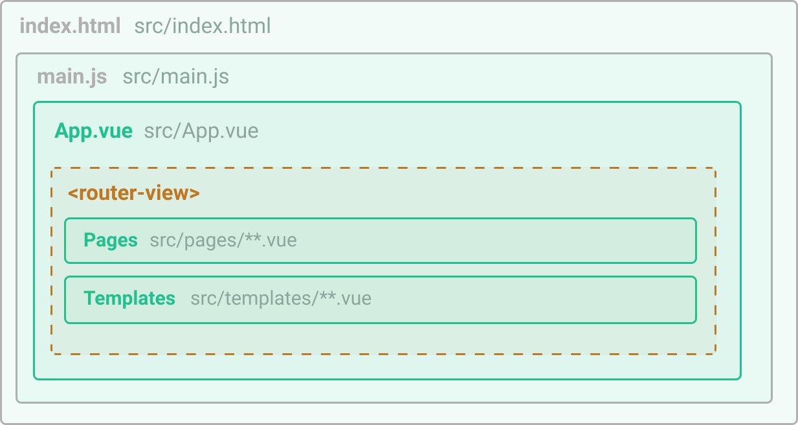

# App structure

A basic app structure looks like this:




## index.html

This is the file that is used to generate all files.

Gridsome adds `index.html` automatically, but you can override it by adding a `index.html` file in `src` folder with this content:

```html
<!DOCTYPE html>
<html ${htmlAttrs}>
  <head>
    ${head}
  </head>
  <body ${bodyAttrs}>
    ${app}
    ${scripts}
  </body>
</html>
```

*Note: you must restart `gridsome develop` after adding a custom `index.html` file.*

## main.js

Import global styles and scripts here. The file also has an export function that has access to the **Client API**. This file is the place to install Vue plugins, register components and directives, etc.

[Read more about using the Client API in main.js](/docs/client-api/)

## App.vue

The `App.vue` file is the main component that wraps all your pages and templates. You can override the default file by having your own `App.vue` file in your `src` directory. Overriding it is useful if you want to have a layout that is shared across all your pages (Like Header & Footer). Or if you want to have a `<transition>` component around the `<router-view>`.

Gridsome adds `App.vue` automatically, but you can override it by adding a `App.vue` file in `src` folder with this content: 

```html
<template>
  <router-view />
</template>
```

<Info>

`<router-view>` is a component that is used for SPA navigation. `<g-link>` replaces the view with the page component for the link without a page refresh. This also means you can have transitions between views.

</Info>

*Note: you must restart `gridsome develop` after adding a custom `App.vue` file.*