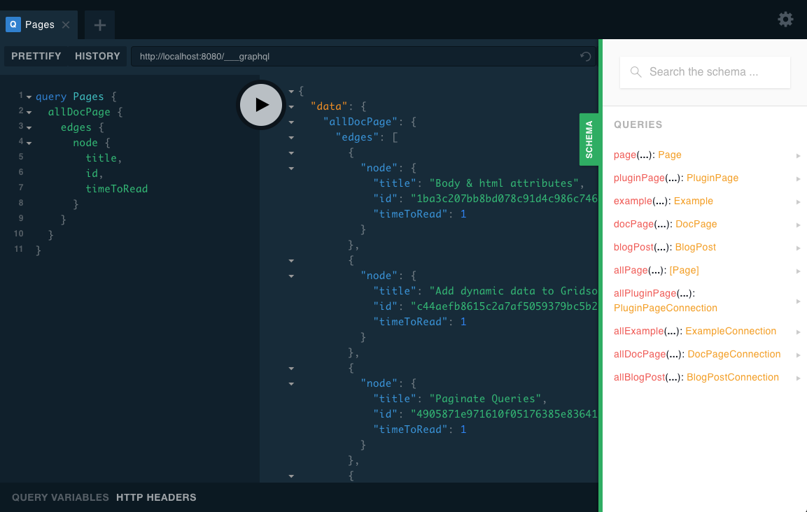

# Collections

> A collection is a group of nodes and each node contains fields with custom data. Collections are useful if you are going to have blog posts, tags, products etc. on your site.

## Adding a collection

Collections can be added by [source plugins]() or you can do it yourself with the [Data Store API](/docs/data-store-api). The collections are stored in a local in-memory data store during `development` and `build`. Nodes can be **sourced** from local files (Markdown, JSON, YAML etc.) or any external APIs.


### Add collections with Data Store API

This example creates a collection named `Post`, fetches content from an external API and adds the results as nodes to the collection.

```js
// gridsome.server.js
const axios = require('axios')

module.exports = function (api) {
  api.loadSource(async actions => {
    const collection = actions.addCollection('Post')

    const { data } = await axios.get('https://api.example.com/posts')

    for (const item of data) {
      collection.addNode({
        id: item.id,
        title: item.title,
        content: item.content
      })
    }
  })
}
```

Learn more about the [Data Store API](/docs/data-store-api).

### Add collections with Source plugins

This example creates collections from a WordPress site. The `typeName` option for source plugins are usually for prefixing collection names that the plugin adds.

```js
// gridsome.config.js
module.exports = {
  plugins: [
    {
      use: '@gridsome/source-wordpress',
      options: {
        baseUrl: 'YOUR_WEBSITE_URL',
        typeName: 'WordPress',
      }
    }
  ]
}
```

You can browse **source plugins** on the [plugin page](/plugins).

## Collections in GraphQL

Each collection will add two root fields to the [GraphQL schema](/docs/data-layer) that are used to retrieve nodes in your pages. The field names are autogenerated based on the collection name. If you name the collection `Post`, you will have these fields available in the schema:

- `post` Get a single node by `id`.
- `allPost` Get a list of nodes. *(Can be sorted and filtered.)*

You can browse available fields by opening the **schema** tab in the [GraphQL explorer](/docs/data-layer#the-graphql-explorer).

Read more about how to [query nodes in GraphQL](/docs/querying-data).

## Browse collections

Gridsome has a **GraphQL explorer** that can be used to explore collections and test queries when in development mode. This can usually be opened by going to `http://localhost:8080/___explore` in your.



## Query a collection
Collections are added to a local [GraphQL data layer](/docs/data-layer) that let you query data into any Vue component. 

Learn more here about [how to query data](/docs/querying-data).

## Templates for collections

[Templates](/docs/templates) are used to create single pages for **nodes** in a collection. Nodes needs a corresponding page in order to be presented on its own URL.

[Learn more here](/docs/templates)


